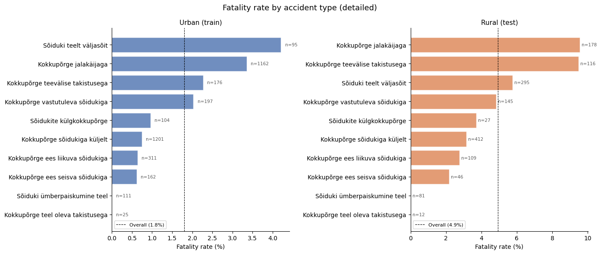
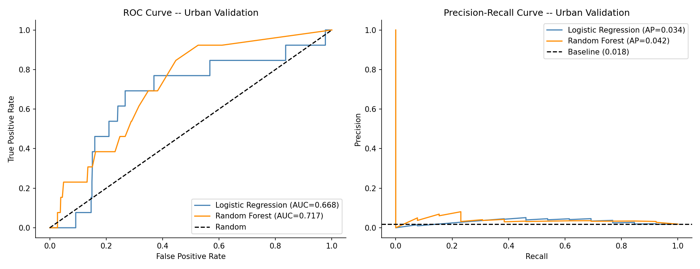
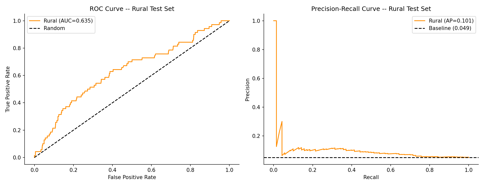

# Predicting Traffic Accident Fatality in Estonia

## Research Question

Can a model trained only on urban accidents predict whether a rural crash will be fatal? This is a binary classification project built on Estonian road accident data from 2018-2025. The main experiment is a distribution shift test: train on urban accidents, apply to rural, and measure  performance when the context changes.

---

## Key Insights

Models trained on urban accidents fail to generalize reliably to rural sccidents, primarily due to data scarcity and structural differences in accident patterns. 
When trained on a larger national dataset (6× more fatal cases), the same model improves from ROC-AUC 0.635 → 0.769.
Simply put: the features work, the data size is the bottleneck.

---

## The experiment

The train/test split is geographic, not random. Urban accidents from 14 Estonian cities form the training set. Rural accidents, excluding highways (speed >= 90 km/h), form the test set. A national dataset covering all of Estonia is used as a feasibility check: how good could this model get with more data?

| Set | Accidents | Fatal | Fatality rate | Role |
|---|---|---|---|---|
| Urban | 3,544 | 64 | 1.81% | Train |
| Rural (speed < 90) | 1,421 | 70 | 4.93% | Test |
| National | 7,178 | 357 | 4.97% | Feasibility ceiling |

Urban and rural sets share zero accident IDs.

**Which accidents are included:** motor vehicle involved, three accident types (collisions, single-vehicle, pedestrian), standard road environments only (no parking lots, forest roads, cycle paths), road width between 3m and 34m, spatial join match within 15m. Full filter logic is in `sql/`.

---

## Terms

| Term | Meaning |
|---|---|
| Fatality rate | Percentage of accidents in a dataset that resulted in at least one death. |
| ROC-AUC | Area Under the Receiver Operating Characteristic Curve. Measures how well a model ranks fatal cases above non-fatal across all possible decision thresholds. A score of 1.0 is perfect; 0.5 is no better than random. |
| PR-AUC | Area Under the Precision-Recall Curve. More informative than ROC-AUC when the positive class (fatal) is rare. |
| Recall | Of all actual fatal accidents, the proportion the model correctly identified as fatal. Also called sensitivity. |
| OHE | One-Hot Encoding - converting a categorical variable (e.g. road condition: dry / wet / icy) into separate binary columns, one per category. |
| Distribution shift | When the statistical properties of the test data differ from the training data. Here: training on urban accidents, testing on rural, where fatality rates and road conditions differ meaningfully. |
| class_weight='balanced' | A model setting that penalises misclassification of the minority class (fatal) proportionally to its rarity, preventing the model from ignoring it entirely. |
| OOD | Out-of-Distribution - data from a context the model was not trained on. Here: rural accidents evaluated against an urban-trained model. |

--- 

## Data overview


*Fatality rate by detailed accident type - urban (left) vs rural (right). The x-axis scales differ: rural overall fatality rate is 4.9% vs 1.8% urban. Run-off-road accidents (Sõiduki teelt väljasõit) are the deadliest category in urban; pedestrian collisions (Kokkupõrge jalakäijaga) top the rural set. The accident type mix and its relationship to fatality shifts substantially between contexts - part of what makes this a genuine distribution shift problem.*

---

## Results

**Final model:** Logistic Regression with `class_weight='balanced'`. Random Forest was not selected for final use - despite a higher ROC-AUC on the ROC curve (0.717 vs 0.668), the PR curve reveals that RF only maintains any precision by almost never predicting fatal, making it unusable in practice. See the curves below.

| Experiment | Train fatal | Test fatal | ROC-AUC | Recall |
|---|---|---|---|---|
| Urban validation | 51 | 13 | 0.668 | 0.615 |
| Urban to Rural | 64 | 70 | 0.635 | 0.500 |
| Rural to Urban (flipped) | 70 | 64 | 0.733 | 0.641 |
| National baseline | 286 | 71 | 0.769 | 0.634 |

ROC-AUC is the primary comparison metric because it measures how well the model ranks fatal accidents above non-fatal ones across all possible decision thresholds at once - the number does not change depending on where you draw the cutoff. Recall depends on the cutoff and is shown here using the default threshold (0.5) across all experiments so the rows are comparable.

**What the numbers say:**

The urban to rural AUC drop of 0.033 confirms distribution shift is real - the model becomes noticeably worse at telling fatal accidents apart from non-fatal ones when applied to a context it was never trained on. The more telling result is the national baseline: same model, same features, 6x more fatal training cases, AUC jumps to 0.769 and recall to 0.634. The features work. The urban experiment was constrained by having only 64 fatal training cases, not by weak features.

The experiment is also asymmetric - rural to urban transfers better than the reverse. Rural training data is more varied in road types and conditions, so the patterns it learns generalise more broadly.



*ROC and PR curves on urban validation set. Random Forest has higher ROC-AUC but the PR curve reveals it achieves this by almost never predicting fatal - the curve collapses immediately. Logistic Regression was selected as the final model.*


*ROC and PR curves on rural test set (Logistic Regression). AUC drops from 0.668 to 0.635 compared to urban validation. The PR curve stays above the baseline (0.049) but the model struggles to maintain precision as recall increases.*

---

## Implications

Models trained on limited or biased subsets of accident data may fail when applied to different environments.
For safety-critical applications, this can lead to underestimation of fatality risk in rural areas.
Improving coverage of high-risk cases (e.g. fatalities) is more impactful than adding new features.

---

## Key limitations

- **64 urban fatal cases** - the fundamental constraint, confirmed by the national baseline
- **Drunk driver data absent** - the `Joobes juht` column was removed from current Maanteamet releases; not a pipeline issue, the data is simply gone
- **Highway segment not modelled** - ~2,200 accidents at speed >= 90 km/h represent a third distinct context excluded here
- **No spatial features** - GPS coordinates available but not used

---

## Stack

- **DuckDB**
- **Python** 
  - pandas
  - scikit-learn
  - matplotlib / seaborn
- **Jupyter**

---

```
data/
    raw_data_sample.csv
figures/
    eda_03_accident_type_detailed.png
    map_preview.png
    roc_pr_curves_urban.png
    roc_pr_rural.png
notebooks/
    01_eda_urban_rural.ipynb
    02_feature_engineering_urban.ipynb
    03_modelling_urban.ipynb
    04_evaluation.ipynb
    05_flipped_experiment.ipynb
    06_national_baseline.ipynb
sql/
    urban_set.sql
    rural_set.sql
    national_set.sql
methodology.md       - detailed data preparation, feature engineering, modelling decisions
data_sources.md      - dataset links and licences
README.md
```

---

## Author

Aleksandra Doroshenko 

## Acknowledgements

This project was completed as part of the Implementing Machine Learning for Technical Specialists course by TalTech.
AI tools were used during the development process to help review and debug code, clarify modelling concepts, and improve documentation. All analysis, data processing, modelling decisions, and conclusions were performed and validated by the author.
